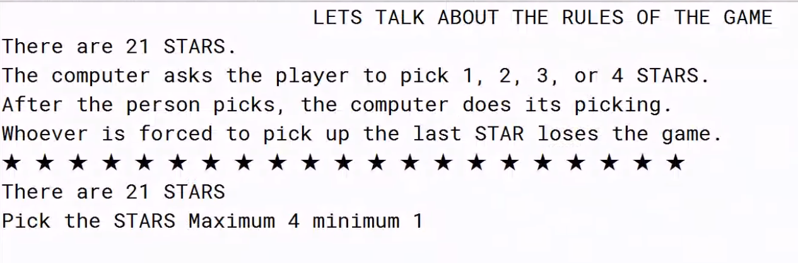

# 21 Stars Game – Java Implementation

A simple but clever mathematical strategy game I first saw years ago… and finally cracked.

---

## Backstory

Back in **9th or 10th grade**, our school computer sir showed us a small logic game he said he had created the **21
Stars Game**.

He claimed:

> “This game is **unbeatable** if played perfectly.”

He challenged the entire class to figure out the logic behind it and recreate it.  
At the time, it felt mysterious, and pretty much none of us could solve it.

Since we were all stuck at home, everyone was taking screenshots of the online classes, and I ended up saving this exact
moment:


Now, in **my 2nd year of college**, I revisited the screenshot and finally understood the strategy behind the game and
implemented the entire thing in **Java**.

And yes… it **is** unbeatable if the computer uses the optimal strategy.  
Feels good to finally crack something that stumped us as kids. :D

---

## The Winning Logic

The key insight is this:

> If the computer makes sure both players pick a total of **5 stars** every round,  
> the player will always be stuck with the last star.

Why 5? Because:

```
21 → 16 → 11 → 6 → 1
```

These numbers appear when the total per round (player and computer) is always 5.

If the computer always responds with:

```
computer_pick = 5 - player_pick
```

…the computer maintains control and forces the endgame.

This is why the original game felt “unbeatable,” It actually *is*, if the opponent knows the math behind it.

---

### Generalized Winning Strategy: Use numbers of the form **5n + 1**

The game isn’t special to 21.  
The key mathematical fact is:

> **Any number of the form `5n + 1` is a guaranteed winning position**  
> for the player who plays *second*, if they use perfect strategy.

Examples:

```
1, 6, 11, 16, 21, 26, ...
```

That means:

- If the game starts at **21**,
- And you are the **second** player,
- You can **always win** by forcing the total picked per turn to be 5.

---

### Why the Second Player Can Always Win

Since 21 is **5 × 4 + 1**, it fits the formula `5n + 1`.

This means:

- If the first player picks X stars,
- The second player simply picks **5 - X**.

This guarantees that after both turns, the star count returns to a number of the form `5n + 1`, eventually landing on *
*1**.

And whoever is forced to pick that **last star loses**.

So the truth is:

> **In a 21-star game, the second player is mathematically guaranteed to win if they play perfectly.**

---

### Generalized Math (for any n ≥ 3)

The original game uses 21 stars and allows picking 1–4 stars.  
In that case, the “magic” number is 5, because:

- You can pick from 1 to 4 → i.e., from 1 to (5 - 1)
- The winning strategy is to make sure each turn pair (player and opponent) sums to 5.

This idea generalizes to **any integer n ≥ 3**:

- On each turn, a player may pick from **1 to n - 1** stars.
- Let `n` be the target sum you want each *pair of turns* (player and opponent) to add up to.
- If the starting number of stars `S` is of the form

$$
S = n.k + 1
$$

for some integer `k ≥ 1`, then the **second player** can always win with perfect play.

These numbers `1, n + 1, 2n + 1, 3n + 1, ...` are the **losing positions** for the player whose turn it is.

The second player’s strategy is simple: `first_player_pick + second_player_pick = n`

on every round.

---

## ▶️ How to Run

Compile:

```bash
javac TwentyOneStarsGame.java
```

Run:

```bash
java TwentyOneStarsGame
```

Requires **Java 8+**.

---

## 📝 License

Free to use, modify, and share — this was a fun nostalgia project.